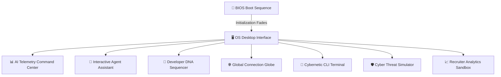

# 🖥️ SUBHAM OS — AI Security Command Center

[](#)
[](#)
[](#)
[](#)

Welcome to **SUBHAM OS**, an immersive, high-fidelity AI-powered developer portfolio website styled as a futuristic security operations center (SOC) and cybernetic operating system. Unlike generic portfolio templates, **SUBHAM OS** integrates real-time telemetry, simulated agent orchestration, MLOps flow visualization, cyber defense sandboxes, and multiple interactive subsystems into a cohesive sci-fi experience.

Designed around a dark cyberpunk grid aesthetics with neon highlights, the portfolio is optimized for speed, performance, and deep interactive engagement.

---

## 🚀 Experience the Subsystems



---

## 🌟 Immersive Features & Modules

### 1. 📡 Bios Boot Sequence (`BootScreen.tsx`)
A cinematic, sci-fi boot-up visualization playing real-time diagnostics, memory checkouts, and decrypted sector loads before fading seamlessly into the primary OS dashboard interface.

### 2. 📊 AI Telemetry Command Center (`CommandDashboard.tsx`)
A sleek, sliding HUD panel reflecting the real-time health of Subham OS. Features:
* Dynamic charts showing GPU load, active LLM nodes, and inference latency.
* High-frequency activity logs reflecting active system events.
* Smooth interactive slider triggers and responsive sliding controls.

### 3. 🤖 Interactive Agent Assistant (`AgentAssistant.tsx`)
An embedded AI companion chatbot that answers technical questions, acts as an interactive resume parser, and converses with recruiters in a customizable, high-fidelity dialogue window.

### 4. 🧬 Developer DNA Sequencer (`DeveloperDNA.tsx`)
A stunning canvas-drawn 3D interactive double helix. Selecting base pairs highlights core developer values, language fluencies, and engineering principles mapped directly onto the technical DNA.

### 5. 🌐 Global Network Globe (`GlobalNetworkMap.tsx`)
An orthographically projected 2D connection map styled as an active network globe. Simulates live routing nodes, geo-pings, and localized server clusters across coordinates.

### 6. 🐚 Cybernetic CLI Terminal (`Terminal.tsx`)
A fully-functional command-line utility with standard commands, autocomplete tips, and shell navigation support:
* Available commands: `about`, `projects`, `skills`, `experience`, `certifications`, `education`, `contact`, `clear`.
* Administrative commands: `sudo reveal-secret`, `sudo matrix`.
* Complete shell history recall using Arrow Keys (Up/Down).

### 7. 🛡️ Cyber Threat Simulator (`ThreatSimulation.tsx`)
An active cybersecurity minigame where users can block, mitigate, and neutralize simulated system alerts and network threats in real time.

### 8. 📈 MLOps Pipeline Hub (`MLOpsPipeline.tsx`)
An interactive, node-based simulation of production machine learning pipelines—stepping through data preparation, training loops, automated testing, model registry logging, and active containerization.

### 9. 🧠 Self-Awareness Engine (`SelfAwarenessEngine.tsx`)
Evaluates user activity patterns to adapt the website's active "mood state" (e.g., *Analytical*, *Hyperactive*, *Stealth*), altering visual palettes and AI responses accordingly.

### 10. 🎯 Recruiter Analytics Suite (`RecruiterAnalysis.tsx`)
Let prospective recruiters inputs their target technology criteria and project needs, instantly calculating fit ratings and recommending matching case study links.

---

## 🛠️ Technological Stack

* **Package Management**: [pnpm Workspaces](https://pnpm.io/) (monorepo architecture)
* **Frontend Core**: [React 18](https://react.dev/) + [TypeScript 5.9](https://www.typescriptlang.org/)
* **Build System**: [Vite 6](https://vite.dev/)
* **Aesthetics & Grid Styling**: [Tailwind CSS v4](https://tailwindcss.com/)
* **Micro-Animations**: [Framer Motion](https://www.framer.com/motion/) + [GSAP](https://gsap.com/)
* **Canvas Rendering**: HTML5 Canvas 2D API (highly optimized for low-latency CPU loads)
* **Auxiliary API**: [Express 5](https://expressjs.com/) (Health monitoring & backend routing skeleton)

---

## 📂 System Directory Layout

```bash
📂 Resume-Site
 ├── 📂 artifacts                     # Primary project build workspace
 │    ├── 📂 portfolio                # Main portfolio Vite application
 │    │    ├── 📂 src
 │    │    │    ├── 📂 components     # High-fidelity reactive widgets
 │    │    │    │    └── 📂 portfolio # Core OS subsystems (Boot, Terminal, Telemetry, etc.)
 │    │    │    ├── 📂 data
 │    │    │    │    └── portfolio-data.ts  # ⚠️ SOURCE OF TRUTH (Resume & Skill Data)
 │    │    │    ├── App.tsx           # Entry application layout
 │    │    │    └── index.css         # Customized cyberpunk dark theme & font systems
 │    │    └── vite.config.ts
 │    └── 📂 api-server               # Backend monitoring server (Express skeleton)
 ├── 📂 lib                           # Shared internal workspace libraries
 │    ├── 📂 api-client-react         # React API binding client
 │    ├── 📂 api-spec                 # OpenAPI spec definitions
 │    └── 📂 api-zod                  # Auto-generated runtime validation schemas
 ├── package.json                     # Monorepo task definitions
 ├── pnpm-workspace.yaml              # Workspace directory configurations
 └── tsconfig.base.json               # Shared TypeScript configurations
```

---

## ⚡ Quick Start & Run Guide

Ensure you have [Node.js v24+](https://nodejs.org/) and [pnpm](https://pnpm.io/) installed locally.

### 1. Install Workspace Dependencies
Execute the clean workspace installation from the root directory:
```bash
pnpm install
```

### 2. Launch Local Dev Servers
Spin up both the Vite frontend portfolio and the telemetry API backend in concurrent development modes:
```bash
# Start frontend and backend servers together
pnpm run dev
```
* **Vite Frontend Portfolio**: Runs on `http://localhost:21113`
* **Telemetry API Server**: Runs on `http://localhost:5000`

### 3. Verify Types & Static Checks
Perform absolute workspace-wide compilation verification:
```bash
pnpm run typecheck
```

### 4. Build Production Bundles
Build all sub-workspaces ready for static CDN deployment:
```bash
pnpm run build
```

---

## ⚙️ Customization Guide

All contents displayed inside the portfolio (projects, work history, skill trees, contact info, bio details) are completely decoupled from code structure. 

To update the website with your own information:
1. Open the source data file: [portfolio-data.ts](file:///c:/Users/light/Downloads/Resume-Site/Resume-Site/artifacts/portfolio/src/data/portfolio-data.ts)
2. Update the objects, structures, and arrays representing your experience.
3. Save the file. The Vite dev server will hot-reload the interface instantly!

---

## 📝 Developer Guidelines & Gotchas

* **Fonts Setup**: Google Fonts (`Orbitron`, `Space Grotesk`, `JetBrains Mono`) are imported inside [index.css](file:///c:/Users/light/Downloads/Resume-Site/Resume-Site/artifacts/portfolio/src/index.css). PostCSS requires all `@import` lines to remain as the **very first lines** in `index.css`; moving them below local declarations will break the font loading.
* **Canvas Performance**: The `NeuralUniverse` and `DeveloperDNA` sequencers are crafted with optimized standard Canvas 2D methods rather than WebGL to maximize framerates on low-resource environments and laptops running on battery save mode.
* **Z-Index System**: The modal layer relies on a structured z-index stacking configuration to prevent command overlays and interactive dashboards from eclipsing the principal desktop viewports. Ensure all new modal components respect standard layers (`z-30` for floating widgets, `z-[45]` for dashboards, and `z-[50]` for full-screen CLI shells).

---

## 🛡️ License

This project is licensed under the MIT License - see the LICENSE file for details.
